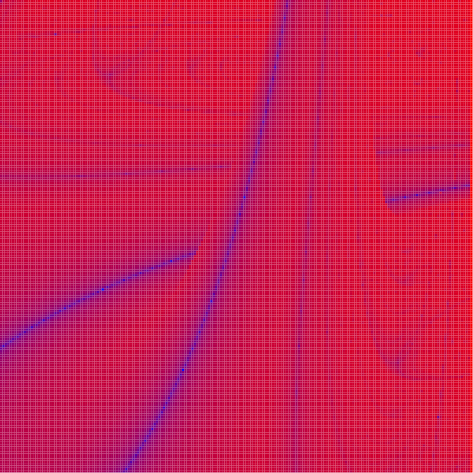

# Fractal de Lyapunov

Este proyecto genera una representación del **Fractal de Lyapunov** utilizando LaTeX con **LuaLaTeX** y **TikZ**.  
El fractal de Lyapunov es una visualización de los **exponentes de Lyapunov** para el mapa logístico, mostrando las regiones de **estabilidad** y **caos** en función de dos parámetros A, B y una secuencia de aplicación de mapas.

En estas imágenes, los colores representan el valor del exponente de Lyapunov:
- **Tonos fríos** (azules) indican estabilidad, donde las órbitas tienden a un punto fijo o ciclo periódico.
- **Tonos cálidos** (rojos) indican caos, donde las órbitas son altamente sensibles a las condiciones iniciales.

El resultado es una figura con una estructura fractal rica en detalles, donde pequeñas variaciones en los parámetros producen patrones complejos y auto-similares.

## Vista previa

## Referencias

- [Exponentes de Lyapunov — Wikipedia](https://es.wikipedia.org/wiki/Exponente_de_Lyapunov)  
- [Fractales y caos — Wikipedia](https://es.wikipedia.org/wiki/Fractal)  
- [Mapa logístico — Wikipedia](https://es.wikipedia.org/wiki/Mapa_log%C3%ADstico)